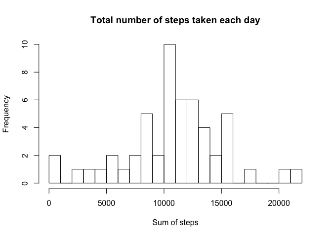
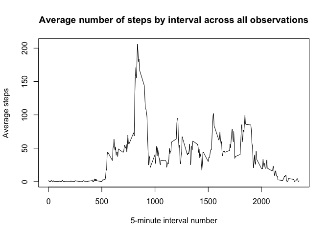
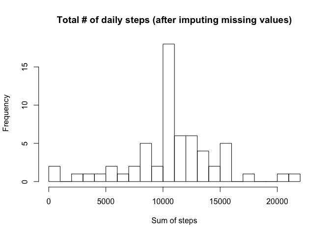

# Reproducible Research: Peer Assessment 1


## Loading and preprocessing the data
The data is loaded using the following code:

```r
# Read all the data into a dataframe "df"
df = read.csv("activity.csv")
# No generic preprocessing required - appropriate preprocessing
# is applied in-context below.
```

## What is mean total number of steps taken per day?
Per the definition of the assignment, we want to know two things:  
        - what is the frequency of ranges of total number of steps taken each day, 
illustrated as a histogram  
        - what is the overall mean and median total number of steps  
To accomplish this, we first obtain the distribution of total number of steps by
date, ignoring incomplete values:

```r
# Extract complete cases (no N/A values anywhere) into a dataframe "dfc"
dfc = df[complete.cases(df),]
# Obtain the distribution of total steps by day
library(plyr)
dft = ddply(dfc, c("date"), summarize, total.steps=sum(steps))
```
Now we histogram the frequency distribution based on ranges of total number of 
steps organized into 25 buckets (roughly corresponding to increments of 1000 steps):

```r
# Plot histogram of frequency of total steps by ranges of totals, have a decent minimum no. of buckets
hist(dft$total.steps, breaks=25, main="Total number of steps taken each day", xlab="Sum of steps")
```

 

Finally, we obtain the overall mean and median values of the total number of steps per day:

```r
meanvalue=as.integer(mean(dft$total.steps))
medianvalue=as.integer(median(dft$total.steps))
```
The <b>mean</b> is <b>10766</b>, and the <b>median</b> is <b>10765</b>.
  
  
## What is the average daily activity pattern?

To obtain the average daily pattern of steps, we first compute a table of average steps
per day, then we do a line plot:

```r
dfi = ddply(df, c("interval"), summarize, avg.steps=mean(steps, na.rm=TRUE))
plot(dfi$interval, dfi$avg.steps, xlab="5-minute interval number", ylab="Average steps",
     main="Average number of steps by interval across all observations", type="l")
```

 
  
Finally, we more-precisely obtain the interval corresponding to the maximum activity
than is approximately apparent from the chart, by identifying the entry with
the highest average, and looking up the corresponding interval number:

```r
dfirow = dfi[dfi$avg.steps == max(dfi$avg.steps),]
maxavgsteps=dfirow$avg.steps
maxinterval=dfirow$interval
maxintervalstr = paste(as.character(as.integer(maxinterval/100)),":",as.character(maxinterval %% 100))
```
  
The interval corresponding to the highest average number of steps (<b>206.1698113</b>) is <b>835</b>, corresponding to <b>8 : 35 hours</b>.  
  
  
## Imputing missing values

The following is the code for computing the number of observations having missing values,
based on already-determined complete cases in code earlier above:  

```r
missingrowcount = nrow(df) - nrow(dfc)
missingrowpct = (missingrowcount/nrow(df))*100
```
  
Per above, there are <b>2304</b> observations having missing values, 
corresponding to 13.1147541 percent.
  
We will impute missing values for the number of steps by replacing each missing value
corresponding to an interval in a given day by the (already-computed, per code
earlier above) average number of steps across all days based on available values
for the same interval, then recompute the total number of steps per interval,
using the following code:  

```r
for (i in 1:nrow(df)) {
        if (is.na(df$steps[i])) {
                hrmin = df$interval[i]
                #convert hrs/mins to normalized interval number in range 1..288
                hrs = as.integer(hrmin/100)
                mins = hrmin %% 100
                ino = ((hrs*60+mins)/5)+1
                df$steps[i]=dfi$avg.steps[ino]
        }
}
dft2 = ddply(df, c("date"), summarize, total.steps=sum(steps))
```
  
  
Now we plot frequency of total steps based on the imputed table, as well as compute the
mean and median, for comparison with the original plot based on complete cases: 
  

```r
hist(dft2$total.steps, breaks=25, main="Total # of daily steps (after imputing missing values)", xlab="Sum of steps")
```

 

```r
meanvalue2=as.integer(mean(dft2$total.steps))
medianvalue2=as.integer(median(dft2$total.steps))
```
The new <b>mean</b> is <b>10766</b>, and the new <b>median</b> is <b>10766</b>.  
  
As is apparent, the new distribution as well as mean and median based on imputed data
are fairly close to those based only on complete cases, which should not be surprising
given that incomplete cases represented only 13.1147541 percent of the observations.  The new distribution also appears to be more uniform and the mean and median pretty
much coincide (but actually not exactly - note that all numbers are rounded to the
nearest integer), which should not be surprising since
we used averages to impute missing values, which had a smoothing effect.

## Are there differences in activity patterns between weekdays and weekends?
  
To answer this question, we apply the following methodology:  
1. Attach a weekday / weekend attribute to the observations with imputed missing
values based on whether the corresponding date falls on a weekday or weekend, respectively.  
2. For each of the two subsets of observations corresponding to weekdays and weekends,
generate a table of average summaries by interval number.  
3. Merge the two summary tables.  
4. Generate a panel line plot using the weekday / weekend attribute to split the plots into
panels, using the lattice package.  
  
Code:  

```r
# Add a weekinfo variable to indicate weekday vs weekend
df$weekinfo=sapply(df$date,
                    FUN=function(dtc){
                            dt=as.Date(dtc,format="%Y-%m-%d")
                            wday=weekdays(dt)
                            if (wday=="Saturday" || wday=="Sunday") {
                                    return("weekend")
                            }
                            return("weekday")
                    }
)
#Generate dataframes of interval vs average number of steps across all observations,
#one each for weekday and weekend
dfiweekend = ddply(df[df$weekinfo=="weekend",], c("interval"), summarize, avg.steps=mean(steps, na.rm=TRUE))
dfiweekend$weektype="weekend"
dfiweekday = ddply(df[df$weekinfo=="weekday",], c("interval"), summarize, avg.steps=mean(steps, na.rm=TRUE))
dfiweekday$weektype="weekday"
dfi=rbind(dfiweekday,dfiweekend)
#Add factor variable for panel plotting purposes
dfi$weektype.f=factor(dfi$weektype,levels=c("weekday","weekend"))
```

Plot:  

```r
library(lattice)
# Do a time series panel plot based on weektype
xyplot(avg.steps~interval|weektype.f, data=dfi, type="l",
           ylab="Number of steps", xlab="Interval",
           layout=c(1,2))
```

 
  
From the above, it appears that on weekends, the average steps are relatively 
evenly distributed throughout the day from mid-morning through late evening, whereas 
on weekdays, there is a pronounced peak period of average steps during early-mid morning,
and a second, less pronounced peak late in the evening.
